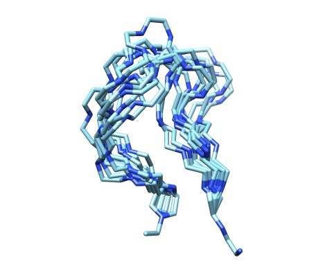
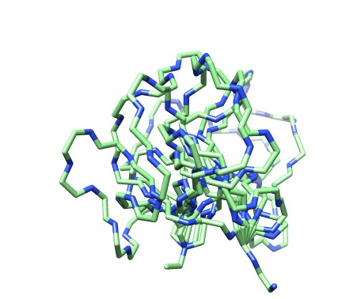

# ilmode

Moving closed-loops with Normal Mode Analysis with constraints in internal coordinates.

 
### Sampling #### 

Move a closed-loop along a given mode direction till reach a give rmsd from the inital conformation: 
<pre>
../sbg/bin/ilmode 3hsz.pdb  81 93 --chain A -i 1 -o _mod1F -m 2 -s 0 -a  1  --rmsd 3.0 --drmsd 0.25 --verb 0
../sbg/bin/ilmode 3hsz.pdb  81 93 --chain A -i 1 -o _mod1B -m 2 -s 0 -a -1  --rmsd 3.0 --drmsd 0.25 --verb 0    
../scripts/renum_tr.pl 3hsz_mod1F_traj.pdb 3hsz_mod1B_traj.pdb > 3hsz_mod1.pdb
</pre>
The first command move forward (-a 1) the 81-93 loop until the rmsd from the inital position is > 3.0 Å (--rmsd 3.0). Every 0.25Å (--drmsd 0.25) away from the intial pose the moved loop coordinates are saved in the 3hsz_mod1F_traj.pdb trajectory file.  The second command do the same but backwards, and the final generate a forward-backward trajectory like this:  
 
<video  width="320px" height="175px"  src="https://user-images.githubusercontent.com/19269061/141765600-329048b6-d184-4ae3-ba90-5e459d7ad189.mp4" autoplay="true" loop="true" controls="controls" >
  </video>

Note how the loop closure is fully mantained despite of the large motion. Please, activate the loop option (right click on play icon) for a better display. 
Here with a different loop.

Here it is another example with a different loop in where we compute all the modes: 
<pre>
for ((i=1;i<=17;i++)); 
do
     echo "processing mode $i";
     ../sbg/bin/ilmode 3irs.pdb 66 76 --chain C -m 2 -i $i -a  1 -s 0 --drmsd 0.25 -o F >> log;
     ../sbg/bin/ilmode 3irs.pdb 66 76 --chain C -m 2 -i $i -a -1 -s 0 --drmsd 0.25 -o B >> log;
     renum_tr.pl  3irsF_traj.pdb  3irsB_traj.pdb > mode_$i.pdb     
done
 </pre>
 And here we display the corresponding results all together:   
 <video  width="320px" height="175px"  src="https://user-images.githubusercontent.com/19269061/141282242-ac69849d-3ceb-4241-8f11-fcdb0ab5c0a4.mp4" autoplay="true" loop="true" controls="controls" >
  </video>

Alternatively to a single mode motion, you can move in the direcction defined by a random contribution of all the modes:   
<pre>
../sbg/bin/ilmode 3hsz.pdb  81 93 --chain A -i 1 -o _allF -m 2 -s 1 -a  1  --rmsd 3.0 --drmsd 0.25 --verb 0
../sbg/bin/ilmode 3hsz.pdb  81 93 --chain A -i 1 -o _allB -m 2 -s 1 -a -1  --rmsd 3.0 --drmsd 0.25 --verb 0 
../scripts/renum_tr.pl 3hsz_allF_traj.pdb 3hsz_allB_traj.pdb > 3hsz_all.pdb
</pre>

Also with option -s 2 can move --ns times  diffenrent random modal directions, in this only 10 conformations.   
<pre>
../sbg/bin/ilmode 3hsz.pdb  81 93 --chain A -i 1 -o _multiple -m 2 -s 2 -a -1  --rmsd 1.0  --ns 10 
</pre>
and you can do it at different rmsds (--rmsd 3.0,--rmsd 3.0).   

   
  
   
   

Rmsd 1.0 Å                 |Rmsd 3.0 Å                 |  Rmsd 6.0 Å
:-------------------------:|:-------------------------:|:-------------------------:
  |    |   

</table>
 <tr width="100">
  <td> </td>
  <td> </td>
  <td> </td>
 </tr>
  <tr>
    <td align="center" ><b style="font-size:30px">  Rmsd 1.0 Å </b></td>
    <td align="center" ><b style="font-size:30px">  Rmsd 3.0 Å </b></td>
    <td align="center" ><b style="font-size:30px">  Rmsd 6.0 Å </b></td>
  </tr>
  </table>

### Morphing ###

<pre>
ilmode DHV17_3hszA1_ali.pdb --start 81 --end 93 --chain A -t DHV17_3ht0A2_ali.pdb -m 2 --skip_missingatoms -a 1 -C 1 --ns 5000 --flanks 1 --aliflank
s --drmsd 0.25 -o  _morph
vmd -m DHV17_3hszA1_ali.pdb DHV17_3ht0A2_ali.pdb  DHV17_3hszA1_ali_4m45A1_af1_traj.pdb 
</pre>
 
 
