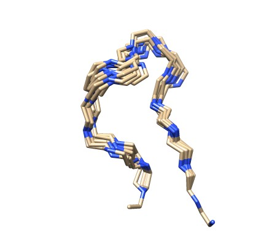
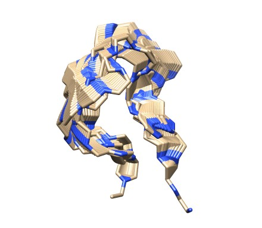
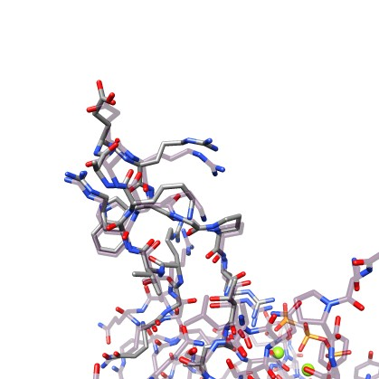

# ilmode

Moving closed-loops with Normal Mode Analysis with constraints in internal coordinates.

 
### Sampling #### 

Move a closed-loop along a given mode direction till reach a give rmsd from the inital conformation: 
<pre>
../sbg/bin/ilmode 3hsz.pdb  81 93 --chain A -i 1 -o _mod1F -m 2 -s 0 -a  1  --rmsd 3.0 --drmsd 0.25 --verb 0
../sbg/bin/ilmode 3hsz.pdb  81 93 --chain A -i 1 -o _mod1B -m 2 -s 0 -a -1  --rmsd 3.0 --drmsd 0.25 --verb 0    
../scripts/renum_tr.pl 3hsz_mod1F_traj.pdb 3hsz_mod1B_traj.pdb > 3hsz_mod1.pdb
</pre>
The first command move forward (-a 1) the 81-93 loop until the rmsd from the inital position is > 3.0 Å (--rmsd 3.0). Every 0.25Å (--drmsd 0.25) away from the intial pose the moved loop coordinates are saved in the 3hsz_mod1F_traj.pdb trajectory file.  The second command do the same but backwards, and the final generate a forward-backward trajectory like this:  
 
<video  width="320px" height="175px"  src="https://user-images.githubusercontent.com/19269061/141765600-329048b6-d184-4ae3-ba90-5e459d7ad189.mp4" autoplay="true" loop="true" controls="controls" >
  </video>

Note how the loop closure is fully mantained despite of the large motion. Please, activate the loop option (right click on play icon) for a better display. 
Here with a different loop.

Here it is another example with a different loop in where we compute all the modes: 
<pre>
for ((i=1;i<=17;i++)); 
do
     echo "processing mode $i";
     ../sbg/bin/ilmode 3irs.pdb 66 76 --chain C -m 2 -i $i -a  1 -s 0 --drmsd 0.25 -o F >> log;
     ../sbg/bin/ilmode 3irs.pdb 66 76 --chain C -m 2 -i $i -a -1 -s 0 --drmsd 0.25 -o B >> log;
     renum_tr.pl  3irsF_traj.pdb  3irsB_traj.pdb > mode_$i.pdb     
done
 </pre>
 And here we display the corresponding results all together:   
 <video  width="320px" height="175px"  src="https://user-images.githubusercontent.com/19269061/141282242-ac69849d-3ceb-4241-8f11-fcdb0ab5c0a4.mp4" autoplay="true" loop="true" controls="controls" >
  </video>

Alternatively to a single mode motion, you can move in the direcction defined by a random contribution of all the modes:   
<pre>
../sbg/bin/ilmode 3hsz.pdb  81 93 --chain A -i 1 -o _allF -m 2 -s 1 -a  1  --rmsd 3.0 --drmsd 0.25 --verb 0
../sbg/bin/ilmode 3hsz.pdb  81 93 --chain A -i 1 -o _allB -m 2 -s 1 -a -1  --rmsd 3.0 --drmsd 0.25 --verb 0 
../scripts/renum_tr.pl 3hsz_allF_traj.pdb 3hsz_allB_traj.pdb > 3hsz_all.pdb
</pre>

Also with option -s 2 can move mutiple times (-ns times) in different random modal directions. For example to obtain only 10 conformations at 1.0Å apart from the original loop conformation use:   
<pre>
../sbg/bin/ilmode 3hsz.pdb  81 93 --chain A -i 1 -o _multiple -m 2 -s 2 -a -1  --rmsd 1.0  --ns 10 
</pre>
and you can do it at different Rmsd cutoffs, i.e,  1.0Å , 3.0Å , and,  6.0Å:  

--rmsd 1.0               |--rmsd 3.0                |--rmsd 6.0                 
:-------------------------:|:-------------------------:|:-------------------------:
  |    |    

finally, you can have in the trajectory file all the intermediate conformations by adding --drmsd <float> option.

../sbg/bin/ilmode 3hsz.pdb  81 93 --chain A -i 1 -o _multiple -m 2 -s 2 -a -1  --rmsd 3.0 --drmsd 0.25 --ns 10 

### Morphing ###

<pre>
ilmode 3irs.pdb  66 76 --chain C -t 3k4w.pdb -m 1 -a 1  --ns 2000 --flanks 2 --aliflanks --drmsd 0.25 -x 
</pre>

<pre>
ilmode 3hsz.pdb  81 93 --chain A -t 3ht0.pdb -m 2 --skip_missingatoms -a 1 -i 1  --ns 2000  --drmsd 0.25 -o  _morph --verb 1 -x --flanks 2 --aliflanks
</pre>

 
 
Initial             | Trajectory               | Final                
:-------------------------:|:-------------------------:|:-------------------------:
  |    |    
