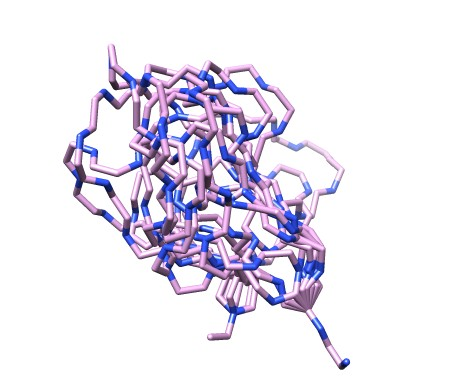
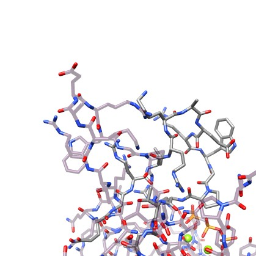

# ilmode

Moving closed-loops with Normal Mode Analysis with constraints in internal coordinates.

 
### Sampling #### 

Move a closed-loop along a given mode direction till reach a give rmsd from the inital conformation: 
<pre>
../sbg/bin/ilmode 3hsz.pdb  81 93 --chain A -i 20 -o _mod1F -m 2 -s 0 -a  1  --rmsd 3.0 --drmsd 0.25 
../sbg/bin/ilmode 3hsz.pdb  81 93 --chain A -i 20 -o _mod1B -m 2 -s 0 -a -1  --rmsd 3.0 --drmsd 0.25   
../scripts/renum_tr.pl 3hsz_mod1F_traj.pdb 3hsz_mod1B_traj.pdb > 3hsz_mod20.pdb
</pre>
The first command moves forward (-a 1) the 81-93 loop until the rmsd from the initial position is > 3.0 Å (--rmsd 3.0). Every 0.25Å away(--drmsd 0.25) from the initial pose the moved loop coordinates are saved in the 3hsz_mod1F_traj.pdb trajectory file.  The second command does the same but backward, and the final one generates a forward-backward trajectory like this: 
 
<video  width="320px" height="175px"  src="https://user-images.githubusercontent.com/19269061/141765600-329048b6-d184-4ae3-ba90-5e459d7ad189.mp4" autoplay="true" loop="true" controls="controls" >
  </video>

Note how the loop closure is fully maintained despite the large motion. Please, activate the loop option for a better display (right-click on the play icon). 
Here there is another example with a different loop in where we compute all the modes:

<pre>
for ((i=1;i<=17;i++)); 
do
     echo "processing mode $i";
     ../sbg/bin/ilmode 3irs.pdb 66 76 --chain C -m 2 -i $i -a  1 -s 0  --rmsd 3.0 -drmsd 0.25 -o F >> log;
     ../sbg/bin/ilmode 3irs.pdb 66 76 --chain C -m 2 -i $i -a -1 -s 0  --rmsd 3.0 -drmsd 0.25 -o B >> log;
     ../scripts/renum_tr.pl   3irsF_traj.pdb  3irsB_traj.pdb > mode_$i.pdb     
done
 </pre>
 And here we display the corresponding results all together:   
 <video  width="320px" height="175px"  src="https://user-images.githubusercontent.com/19269061/141282242-ac69849d-3ceb-4241-8f11-fcdb0ab5c0a4.mp4" autoplay="true" loop="true" controls="controls" >
  </video>

Alternatively to a single mode motion, you can move in the direcction defined by a random contribution of all the modes (option -s 1):   
<pre>
../sbg/bin/ilmode 3hsz.pdb  81 93 --chain A -i 1 -o _allF -m 2 -s 1 -a  1  --rmsd 3.0 --drmsd 0.25 
../sbg/bin/ilmode 3hsz.pdb  81 93 --chain A -i 1 -o _allB -m 2 -s 1 -a -1  --rmsd 3.0 --drmsd 0.25
../scripts/renum_tr.pl 3hsz_allF_traj.pdb 3hsz_allB_traj.pdb > 3hsz_all.pdb
</pre>

Also with option -s 2 can move mutiple times (-ns times) in different random modal directions. For example to obtain only 10 conformations at 1.0Å apart from the original loop conformation use:   
<pre>
../sbg/bin/ilmode 3hsz.pdb  81 93 --chain A -i 1 -o _multiple -m 2 -s 2 -a -1  --rmsd 1.0  --ns 10 
</pre>
and you can do it at different Rmsd cutoffs, i.e,  1.0Å , 3.0Å , and,  6.0Å:  

--rmsd 1.0               |--rmsd 3.0                |--rmsd 6.0                 
:-------------------------:|:-------------------------:|:-------------------------:
  |    |    

finally, you can have in the trajectory file all the intermediate conformations by adding --drmsd <float> option.

../sbg/bin/ilmode 3hsz.pdb  81 93 --chain A -i 1 -o _multiple -m 2 -s 2 -a -1  --rmsd 3.0 --drmsd 0.25 --ns 10 

### Morphing ###

Here we model the transition between two loop conformations deviated 13.0Å away using only the local modes computed by our approach. To this end,   
the initial structure (3hsz.pdb) is iteratively deformed along the lowest modes while the root mean square deviation (RMSD) to a target structure (3ht0.pdb) is minimized. 

<pre>
ilmode 3hsz.pdb  81 93 --chain A -t 3ht0.pdb -m 2 --skip_missingatoms -a 1 -i 1  --ns 2000  --drmsd 0.25 -o  _morph  -x --flanks 2 --aliflanks
</pre>

Initial rmsd=13.0Å             | Trajectory               | Final   rmsd=1.0Å              
:-------------------------:|:-------------------------:|:-------------------------:
  | <video  width="320px" height="175px"  src="https://user-images.githubusercontent.com/19269061/141989128-c48c87b2-0a15-47b2-a560-0dbf5a3ee96e.mp4" autoplay="true" loop="true" controls="controls" > </video> |    

Despite the only dihedral angles being moved we practically have reached the target structure. This and other examples illustrates the potential of this reduced loop-closed modal space for the conformational search. Here you can find another example:  

<pre>
ilmode 3irs.pdb  66 76 --chain C -t 3k4w.pdb -m 1 -a 1  --ns 2000 --flanks 2 --aliflanks --drmsd 0.25 -x 
</pre>
